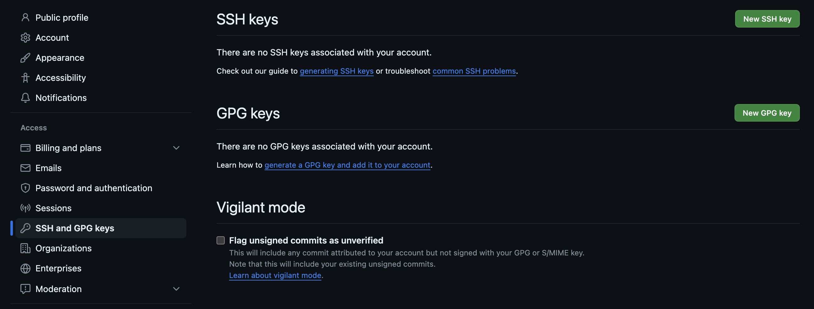
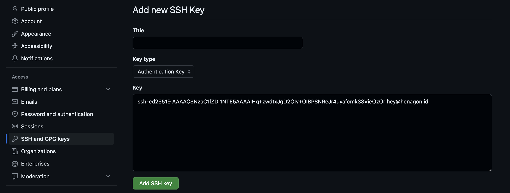

## Permasalahan
Terkadang kita memiliki 2 buah akun github, baik itu untuk pribadi & pekerjaan, atau alasan lain. Muncul kendala ketika konfigurasi repository dengan SSH, karena satu SSH _Key_ hanya dapat digunakan di dalam satu akun github. Ketika kita paksakan untuk menambahkan ssh key yang sudah digunakan di akun github lain, tentu akan muncul pesan _error_, serta ssh _key_ & akun github tidak akan terhubung.


## Membuat SSH Key Baru
Langkah pertama adalah membuat sebuah _ssh key_ baru di directory `~/.ssh`. Di sini saya menggunakan kriptografi **ed25519**.

```zsh
~
$ cd .ssh

~/.ssh
$ ssh-keygen -t ed25519 -C "hey@henagon.id"
```

Selanjutnya berikan nama file yang sesuai dengan tujuan pembuatan SSH Key ini. Dalam kasus saya, saya beri nama `id_henagon`. Pastikan bahwa ketika sedang membuat _ssh key_ ini, kita sedang berada di _directory_ `~/.ssh`. Maka akan terbuat dua buah _file keys_, yaitu _private key_ yang tanpa ekstensi dan _public key_ dengan ekstensi `.pub`.

```zsh
Generating public/private ed25519 key pair.
Enter file in which to save the key (/Users/dev/.ssh/id_ed25519): id_henagon
Enter passphrase (empty for no passphrase):
Enter same passphrase again:
Your identification has been saved in id_henagon
Your public key has been saved in id_henagon.pub
The key fingerprint is:
SHA256:********** hey@henagon.id
The key's randomart image is:
+--[ED25519 256]--+
|^EB*o.           |
|O% .=            |
|*oo  o.          |
|=..  . o         |
|.. . .+ S        |
|    =o o .       |
|   o .+ ...      |
|    .oo .+. .    |
|    o+.o  oo     |
+----[SHA256]-----+
```

## Pasang SSH Key ke GitHub
Setelah SSH Key selesai dibuat, selanjutnya adalah menempatkan / menambahkan SSH Key yang telah dibuat ke dalam GitHub.
- Masuk ke menu ***Setting***
- Masuk ke ***SSH and GPG Keys***
- Kemudian pilih ***New SSH Key***

- *Copy Public Key* dari *SSH Key* yang telah dibuat sebelumnya, via terminal
```zsh
cat id_henagon.pub| pbcopy
```
- *Paste Public Key* yang telah *dicopy* ke dalam *inputan key* di *form* ***Add New SSH Key***
- Kemudian klik Add SSH Key


## Buat Host Alias di Konfigurasi SSH
Selanjutnya yang harus dilakukan adalah membuat alias untuk akun github yang baru ini. Pada kasus ini, dibuat SSH Host yang mengarah ke github.com menggunakan SSH Key yang telah dibuat di atas. Kemudian kombinasi Host dan SSH Key ini dibuatkan alias baru dengan nama `github-henagon`

```ssh-config
Host github-henagon
	HostName github.com
	User git
	IdentityFile ~/.ssh/id_henagon
```

## Local dan Remote Repository
Selanjutnya adalah menyambungkan antara local repository dan remote repository.

### Buat Remote Repository di GitHub
Pertama, bisa dibuatkan *repository* baru pada akun GitHub, atau bisa juga menggunakan *repository* yang telah ada sebelumnya.

### Tambahkan Remote Origin di Local Repository
Untuk menambahkan remote origin, ubah origin yang awalnya `git@github.com:user/repo.git` menjadi `git@github-henagon:user/repo.git`.
```zsh
git remote add origin git@github-henagon:henagonid/main-site.git
```
Git sudah bisa digunakan untuk melakukan push atau pull seperti biasa.

## Kesimpulan
Pada dasarnya untuk bisa menggunakan *multiple* akun GitHub dalam satu komputer adalah di sisi Konfigurasi SSH nya. Penggunaan alias dalam kombinasi *Host & SSH Key* yang digunakan. Bisa juga ditambahkan beberapa akun sebanyak yang dibutuhkan.
